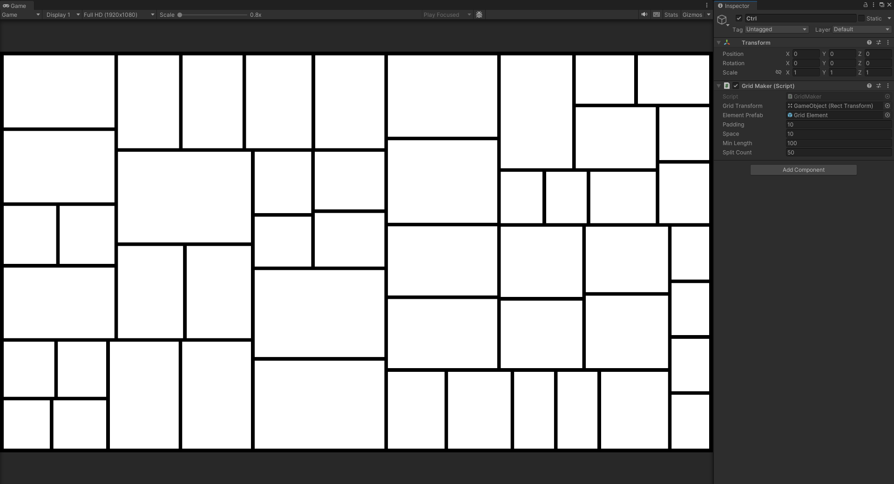
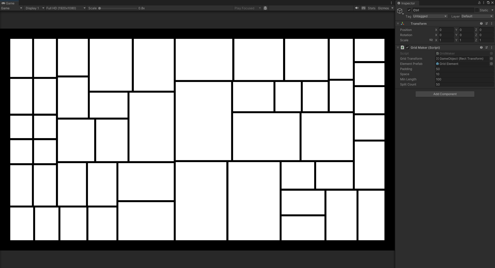
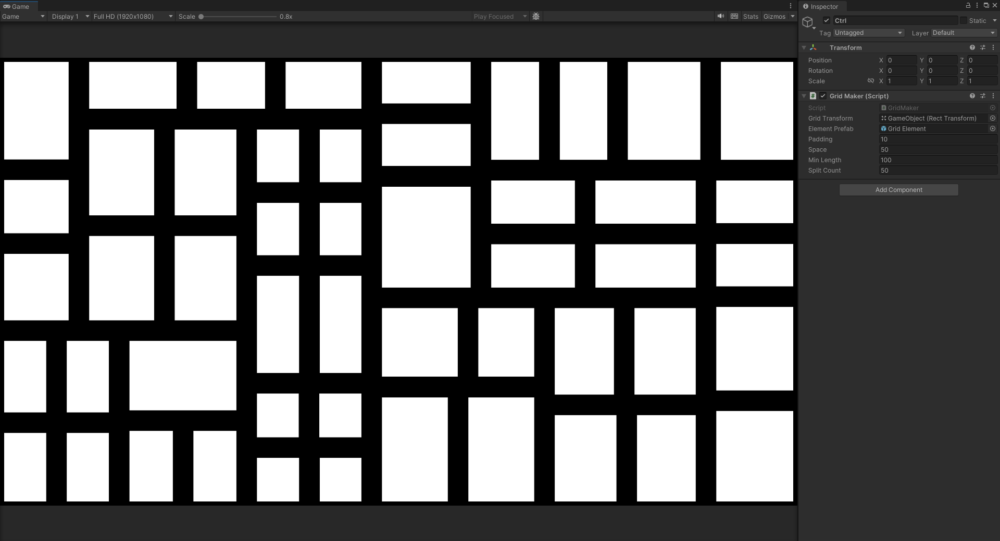
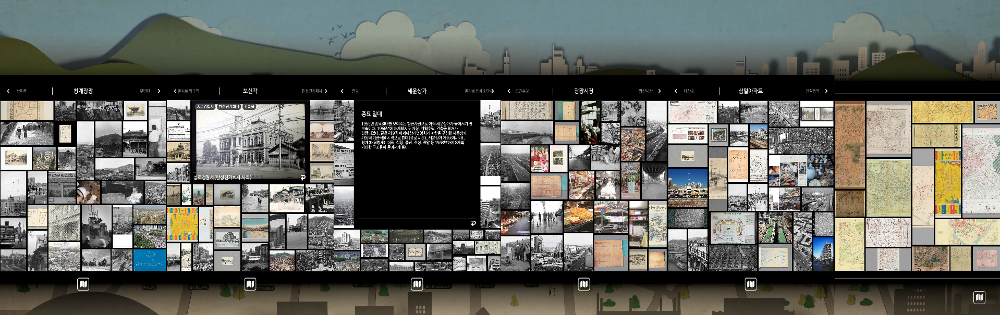

# 실시간 랜덤 그리드 레이아웃 생성기
이 프로젝트는 주어진 영역 내에서 랜덤한 형태의 그리드 레이아웃을 동적으로 생성하는 레이아웃 유틸리티입니다. 
고정된 행·열 구조가 아닌, 분할 기준에 따라 불균등한 셀 구조를 생성할 수 있도록 설계되었습니다. 
 
UI 배치, 콘텐츠 레이아웃 등 정형화되지 않은 그리드가 필요한 경우를 목적으로 합니다. 

**예제 프로젝트** ⇒ https://github.com/Seok-Min-Lee/PP_03_02_GridWall 

### 조절 가능한 파라미터
<table>
  <tr>
    <td width="150">변수</td>
    <td width="850">설명</td>
  </tr>
  
  <tr>
    <td width="150">padding</td>
    <td width="850">전체 레이아웃 외곽 여백</td>
  </tr>
  
  <tr>
    <td width="150">space</td>
    <td width="850">각 셀 간의 간격</td>
  </tr>
  
  <tr>
    <td width="150">minLength</td>
    <td width="850">셀 분할 시 허용되는 최소 길이</td>
  </tr>
  
  <tr>
    <td width="150">splitCount</td>
    <td width="850">목표 셀 개수 (최대 분할 수)</td>
  </tr>
</table>
<table>
  <tr>
    <td width="150">
      <b>default</b>  
      padding: 10 
      space: 10 
      minLength: 100 
      splitCount: 50 
    </td>
    <td colspan="3">
      
    </td>
  </tr>
  <tr>
    <td width="150">
      padding: 50 
    </td>
    <td width="350">
      
    </td>
    <td width="150">
      space: 50 
    </td>
    <td width="350">
      
    </td>
  </tr>
  <tr>
    <td width="150">
      minLength: 50 
    </td>
    <td width="350">
      
    </td>
    <td width="150">
      minLength: 50 
      splitCount: 200 
    </td>
    <td width="350">
      
    </td>
  </tr>
</table>

## 활용 예시
<ul>
  <li>[2025.05] 신세계 더 헤리티지 (舊 제일은행) - 미디어월</li>
  <li>[2023.12][2022.12] 국립중앙박물관 기증관 - 아카이브 키오스크</li>
  <li>[2023.04] 청계천 박물관 - 미디어월 </li>
</ul>
